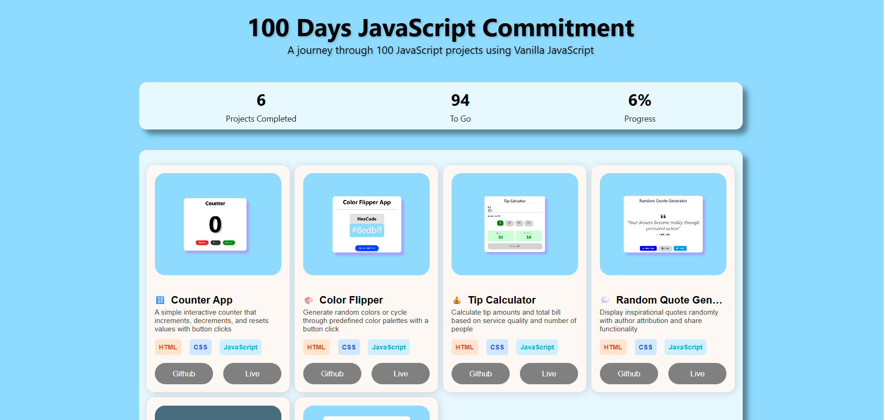

# 100 Days JavaScript Commitment

A collection of 100+ JavaScript projects built with Vanilla JavaScript, and later rebuilt the same set of project in React.js to demonstrate progressive learning and mastery.

## 🎯 Project Goals

- Build 100 projects using Vanilla JavaScript
- Deploy all projects for live demonstration
- Document learning journey and best practices

## 📁 Project Structure

```
100-Days-javascript-commitment/
├── README.md
├── index.html (Homepage)
├── assets/
│   ├── css/
│   │   └── landing.css
│   ├── js/
│   │   └── landing.js
│   └── images/
│       ├── images1.png
│       ├── images2.png
│       ├── images3.png
│       └── ...
│
├── projects/
│   ├── 01-counter-app/
│   │   ├── index.html
│   │   ├── style.css
│   │   ├── script.js
│   │   ├── README.md
│   │   └── preview.png
│   ├── 02-calculator/
│   │   ├── index.html
│   │   ├── style.css
│   │   ├── script.js
│   │   ├── README.md
│   │   └── preview.png
│   └── ...
└── .gitignore
```

## 📋 Projects List

<!-- Update this table as you complete projects -->

| #   | Project Name    | Status       | Live Demo                                                                            | Source Code                        |
| --- | --------------- | ------------ | ------------------------------------------------------------------------------------ | ---------------------------------- |
| 001 | **Counter App** | ✅ Completed | [Demo](https://100-days-javascript-commitment.netlify.app/projects/001-counter-app/) | [Code](./projects/001-counter-app) |
| 002 | **Next**        | ⏳           | -                                                                                    | -                                  |

## 🚀 Getting Started

1. Clone this repository
2. Navigate to any project folder
3. Open `index.html` in your browser
4. Each project is self-contained and ready to run

## 🛠️ Technologies Used

- **Vanilla JavaScript** - ES6+ features
- **HTML5** - Semantic markup
- **CSS3** - Modern styling, Flexbox, Grid

## 📝 Project Template

Each project follows this structure:

- `index.html` - Main HTML file
- `style.css` - Styling
- `script.js` - JavaScript logic
- `README.md` - Project-specific documentation
- `preview.png` - Screenshot for project page

## 🌐 Deployment

Projects are deployed on:

- **GitHub Pages**: [github](https://github.com/abhi790/100-Days-Javascript-Commitment/tree/main)
- **Netlify**: [netlify](https://100-days-javascript-commitment.netlify.app/)

## 📈 Progress Tracker

- **Completed**: 1/100
- **Remaining**: 99/100
- **Progress**: 2%

## 👤 Author

## Abhimanyu Kumar Roy

- [GitHub](https://github.com/abhi790)
- [LinkedIn](https://www.linkedin.com/in/abhideveloper/)

## 

## 📄 License

MIT License - feel free to use these projects for learning!

---
