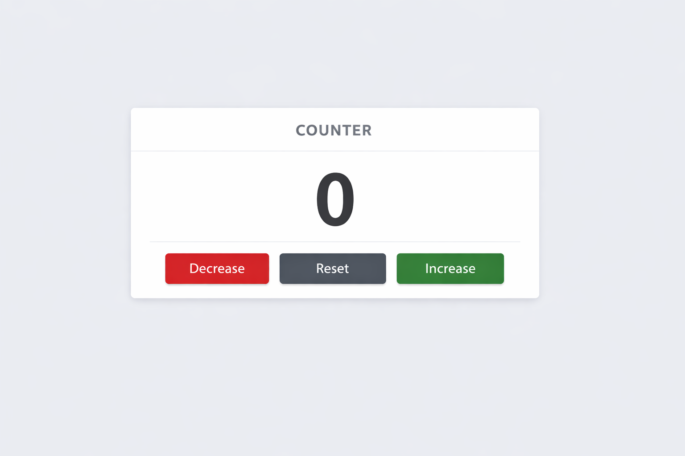

## Project 001 - Counter App

# Counter App

Simple counter with increment and decrement.

## Features

✅ Display counter value
✅ Increment button
✅ Decrement button
✅ Reset button
✅ Real-time updates
✅ Responsive design

## 🛠️ Technologies Used

- HTML5
- CSS3 (Flexbox, Gradients)
- Vanilla JavaScript (ES6+)

## Live Demo

🔗 [View Live](https://100-days-javascript-commitment.netlify.app/projects/001-counter-app/)

## 📚 What I Learned

- Event listeners
- Variable manipulation
- DOM updates
- Button click handling

## 📸 Preview

<!-- change this with original project image file after completion of the project -->

## 

**Day**: 1/100
**Time Spent**: ~2 hours

---
