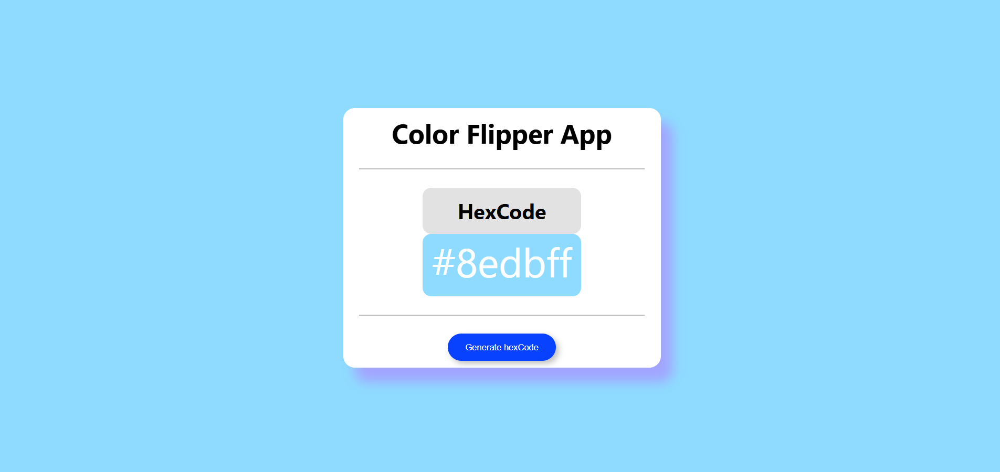

## Project 002 - Color Flipper

# Color Flipper

Change background color randomly.

## Features

✅ Random color generation
✅ Background color change
✅ Color code display
✅ Smooth transition
✅ Copy color option
✅ Responsive design
✅ Copy to clipboard

## 🛠️ Technologies Used

- HTML5
- CSS3 (Flexbox, Gradients)
- Vanilla JavaScript (ES6+)

## Live Demo

🔗 [View Live](https://100-days-javascript-commitment.netlify.app/projects/002-color-flipper/)

## What I Learned

- Random number generation
- Hex color conversion
- Background styling
- Color manipulation
- 'click' Event listeners
- Variable manipulation
- DOM updates
- Button click handling
- Clean UI using CSS only
- Copy to clipboard on click - navigator.clipboard.writetext(text)
- Simple Design

## 📸 Preview

<!-- change this with original project image file after completion of the project -->

## 
