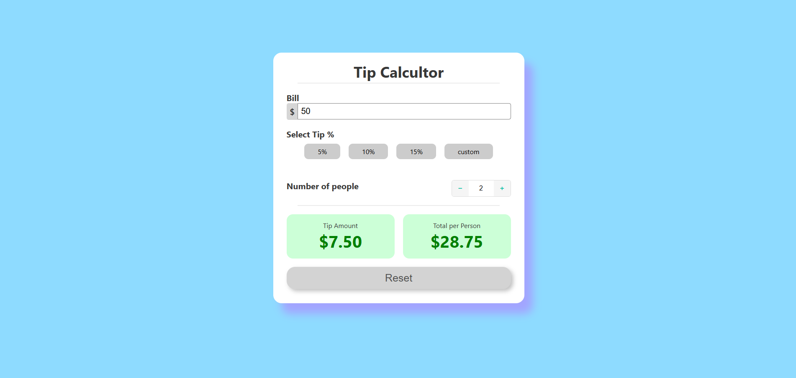

## Project 003 - Tip Calculator

# Tip Calculator

Calculate tip and total amount.

## Features

✅ Bill amount input
✅ Tip percentage input
✅ Preset tip buttons
✅ Calculate tip
✅ Show total
✅ Responsive design

## 🛠️ Technologies Used

- HTML5
- CSS3 (Flexbox, Gradients)
- Vanilla JavaScript (ES6+)

## Live Demo

🔗 [View Live](https://100-days-javascript-commitment.netlify.app/projects/003-tip-calculator/)

## What I Learned

- Input handling
- Mathematical calculations
- Real-time updates
- 'click' Event listeners
- Variable manipulation
- DOM updates
- Button click handling
- Clean UI using CSS only
- Simple Design
- adding class dynamically and removing it using classList

## 📸 Preview

## 
