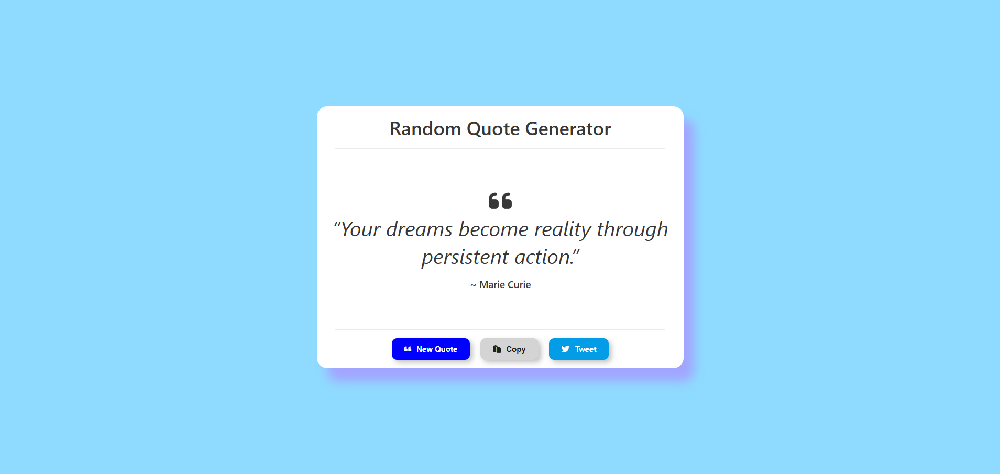

## Project 004 - Random Quote Generator

# Random Quote Generator

Display random motivational quotes.

## Features

✅ Random quote display
✅ Author attribution
✅ New quote button
✅ Quote array
✅ Color change
✅ Twitter share
✅ Smooth transition

## 🛠️ Technologies Used

- HTML5
- CSS3 (Flexbox, Gradients)
- Vanilla JavaScript (ES6+)

## Live Demo

🔗 [View Live](https://100-days-javascript-commitment.netlify.app/projects/004-random-quote/)

## What I Learned

- Array of 1000 random quotes
- Random number generator
- DOM element updates
- API integration (used navigator.clipboard.write(text)) for copy to clipboard functionality
- 'click' Event listeners
- Variable manipulation
- DOM updates
- Button click handling
- Clean UI using CSS only
- Simple Design
- used Font Awesome library for social icon and paste icon

## 📸 Preview

## 
