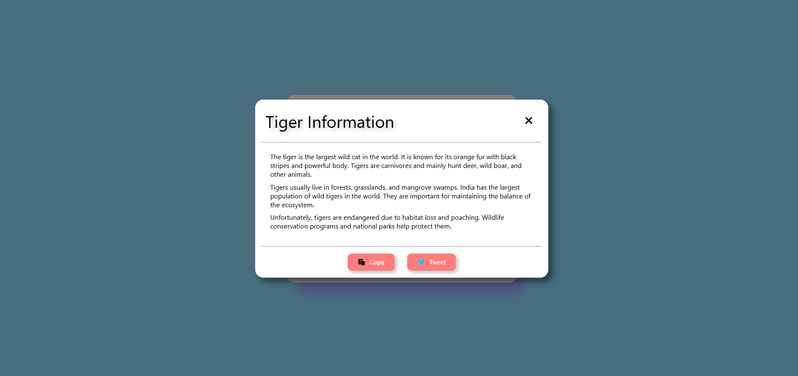

## Project 005 - Modal Popup

# Modal Popup

Modal dialog component.

## Features

✅ Modal open/close
✅ Close button
✅ Overlay click close
✅ ESC key close
✅ Modal content
✅ Smooth animation
✅ Responsive design
✅ Copy to clipboard fully functional
✅ Used Random data in the modal, on click of openModal fresh data load randomly
✅ actual share to twitter is not implemented only feedback is shown.

## 🛠️ Technologies Used

- HTML5
- CSS3 (Flexbox, Gradients)
- Vanilla JavaScript (ES6+)

## Live Demo update project folder name after projects/

🔗 [View Live](https://100-days-javascript-commitment.netlify.app/projects/005-modal-popup/)

## 📚 What I Learned - mention list of project

- 'click' Event listeners
- Variable manipulation
- DOM updates
- Math.random used select random data for modal
- Button click handling
- Clean UI using CSS only
- Simple Design
- adding class dynamically and removing it using classList
- CSS overlays
- Modal patterns
- Event handling
- Flexbox centering
- Overlay pattern
- Event bubbling
- stopPropagation()
- DOM event listeners
- setTimeOut used to remove feedback after 1500msec

## 📚 Scope for Improvent

- Share to twitter and other social media can be implemented.
-

## 📸 Preview

<!-- change this with original project image file after completion of the project -->

## 
