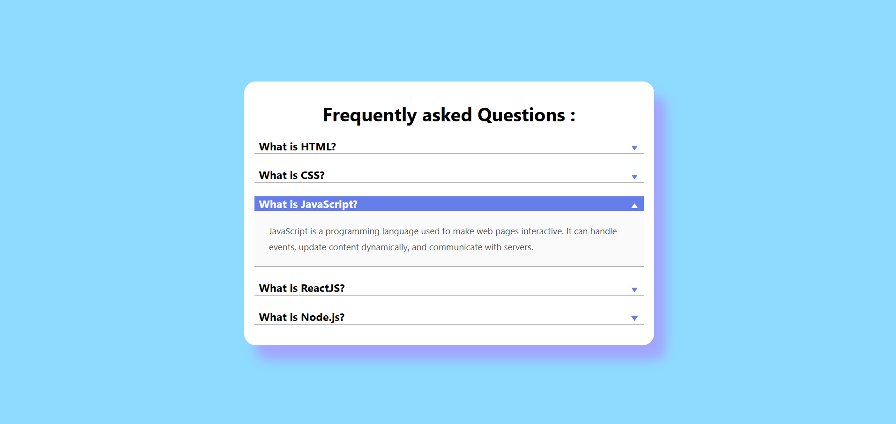

## Project 006 - Accordion Menu

# Accordion Menu

Expandable accordion sections.

## Features

✅ Click to expand
✅ Click to collapse
✅ Arrow rotation
✅ Smooth animation
✅ Multiple/single open
✅ Responsive design

## 🛠️ Technologies Used

- HTML5
- CSS3 (Flexbox, Gradients)
- Vanilla JavaScript (ES6+)

## Live Demo

🔗 [View Live](https://100-days-javascript-commitment.netlify.app/projects/006-accordion-menu/)

## What I Learned

- Toggle functionality
- CSS transitions
- Class management
- Content visibility-
- 'click' Event listeners
- Variable manipulation
- DOM updates
- Button click handling
- Clean UI using CSS only
- Simple Design
- adding class dynamically and removing it using classList

## 📸 Preview - update image of the app

<!-- change this with original project image file after completion of the project -->

## 
