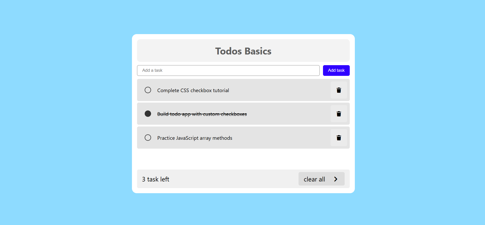

## Project 007 - Todo List (Basic)

# Todo List (Basic)

Simple todo tracker.

## Features

✅ Add todos
✅ Mark complete
✅ Delete todos
✅ Task counter
✅ List display
✅ Responsive design

## 🛠️ Technologies Used

- HTML5
- CSS3 (Flexbox, Gradients)
- Vanilla JavaScript (ES6+)

## Live Demo

🔗 [View Live](https://100-days-javascript-commitment.netlify.app/projects/007-todo-basic/)

## What I Learned

- Array manipulation
- DOM rendering
- Event delegation
- CRUD operations
- 'click' Event listeners
- Variable manipulation
- DOM updates
- Button click handling
- Clean UI using CSS only
- Simple Design

## 📸 Preview

## 
