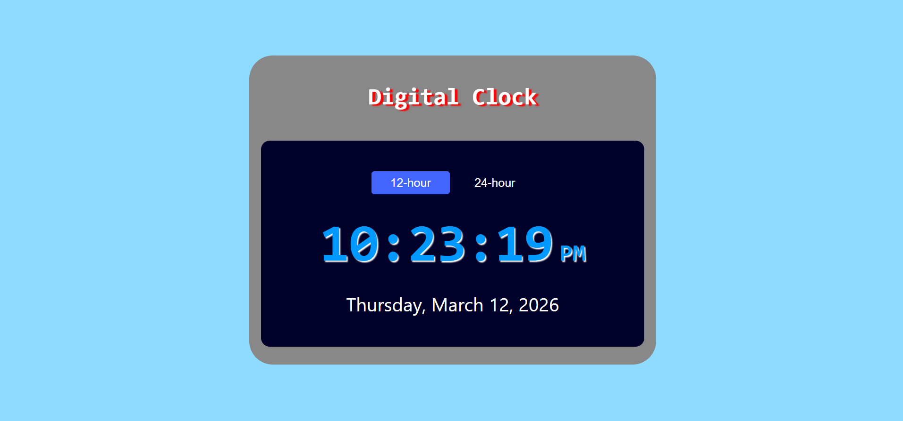

## Project 008 - Digital Clock

# Digital Clock

Real-time clock display.

## Features

✅ Current time display
✅ HH:MM:SS format
✅ Real-time updates
✅ AM/PM indicator
✅ Large readable text
✅ Responsive sizing

## 🛠️ Technologies Used

- HTML5
- CSS3 (Flexbox, Typography)
- Vanilla JavaScript (ES6+)

## Live Demo

🔗 [View Live](https://100-days-javascript-commitment.netlify.app/projects/008-digital-clock/)

## What I Learned

- Date object manipulation
- setInterval timer
- Time formatting
- Continuous updates
- String padding methods
- 12/24 hour format conversion

## 📸 Preview

