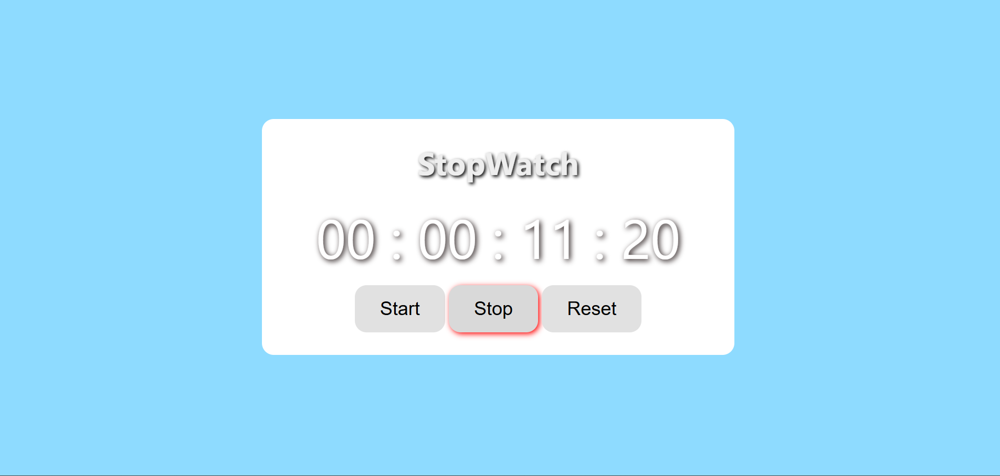

## Project 009 - Stopwatch

# Stopwatch

Timer with start/stop.

## Features

✅ Start button
✅ Stop button
✅ Reset button
✅ Time display
✅ Lap functionality
✅ Accurate timing

## Future Scope

- Lap time recording capabilities
- Performance.now() for accuracy

## 🛠️ Technologies Used

- HTML5
- CSS3 (Flexbox, Grid)
- Vanilla JavaScript (ES6+)

## Live Demo

🔗 [View Live](https://100-days-javascript-commitment.netlify.app/projects/009-stopwatch-app/)

## What I Learned

- Timer management
- Start/stop logic
- Time tracking
- Button states

## 📸 Preview

