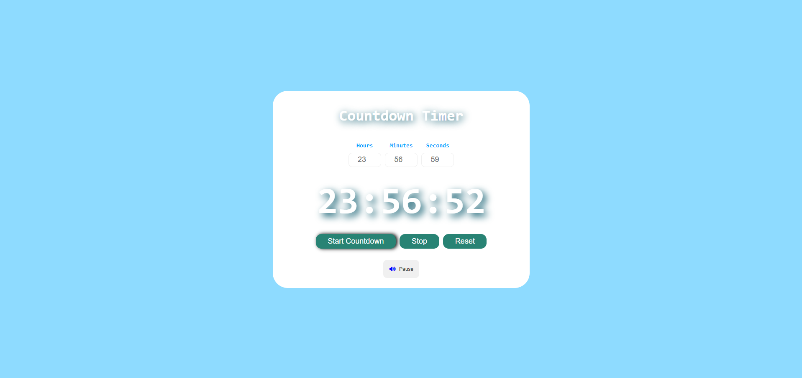

## Project 010 - Countdown Timer

# Countdown Timer

Countdown to zero with alert.

## Features

✅ Time input
✅ Countdown display
✅ Start button
✅ Reset button
✅ Audio alert
✅ Progress bar
✅ Responsive design

## 🛠️ Technologies Used

- HTML5
- CSS3 (Flexbox, Animations)
- Vanilla JavaScript (ES6+)

## Live Demo

🔗 [View Live](https://100-days-javascript-commitment.netlify.app/projects/010-countdown-timer/)

## What I Learned

- Time calculation
- Countdown logic
- Audio playback
- Timer state management
- Progress bar updates - not yet implemented
- Time remaining calculations

## 📸 Preview

