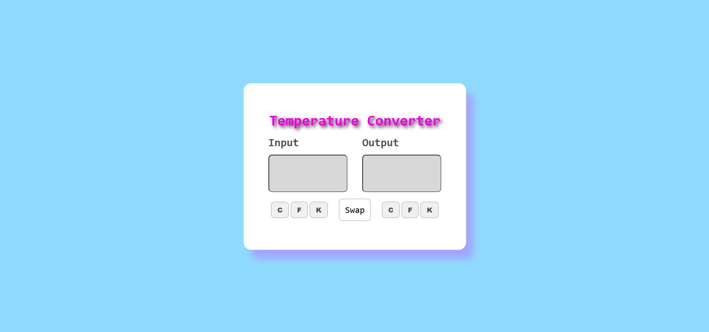

## Project 012 - Temperature Converter

# Temperature Converter

Convert Celsius to Fahrenheit.

## Features

✅ Celsius input
✅ Fahrenheit input
✅ Bidirectional conversion
✅ Real-time update
✅ Kelvin display
✅ Responsive design

## 🛠️ Technologies Used

- HTML5
- CSS3 (Flexbox, Grid)
- Vanilla JavaScript (ES6+)

## Live Demo

🔗 [View Live](https://100-days-javascript-commitment.netlify.app/projects/012-temperature-converter/)

## What I Learned

- Conversion formulas
- Two-way calculations
- Real-time input handling
- Number precision
- Multiple unit conversions
- Input event listeners

## 📸 Preview

