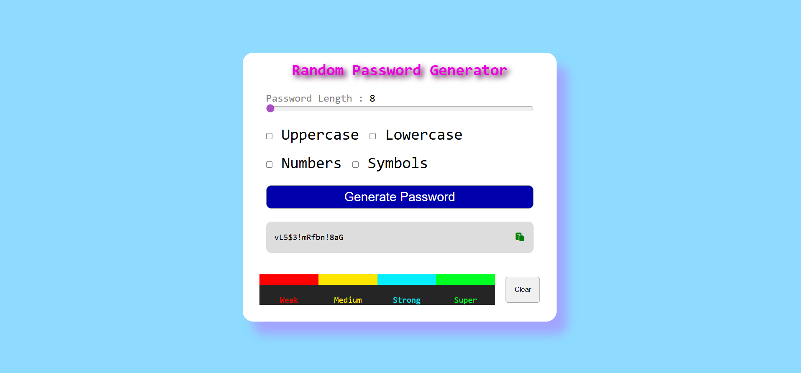

## Project 013 - Random Password Generator

# Random Password Generator

Generate secure passwords.

## Features

✅ Password generation
✅ Length selector
✅ Character options
✅ Copy to clipboard
✅ Strength indicator
✅ Responsive design

## 🛠️ Technologies Used

- HTML5
- CSS3 (Flexbox, Grid)
- Vanilla JavaScript (ES6+)

## Live Demo

🔗 [View Live](https://100-days-javascript-commitment.netlify.app/projects/013-random-password-generator/)

## What I Learned

- Random character selection
- String concatenation
- Clipboard API
- Password strength logic
- Checkbox handling
- Character set management

## 📸 Preview

