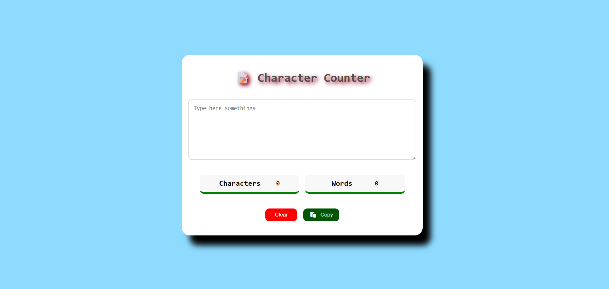

## Project 014 - Character Counter

# Character Counter

Count characters in text.

## Features

✅ Character count
✅ Real-time update
✅ Word count
✅ Max limit
✅ Clear button
✅ Responsive design

## 🛠️ Technologies Used

- HTML5
- CSS3 (Flexbox, Gradients)
- Vanilla JavaScript (ES6+)

## Live Demo

🔗 [View Live](https://100-days-javascript-commitment.netlify.app/projects/014-character-counter/)

## What I Learned

- Input event handling
- String length calculation
- Real-time updates
- Progress visualization
- Word counting logic
- Textarea manipulation

## 📸 Preview

