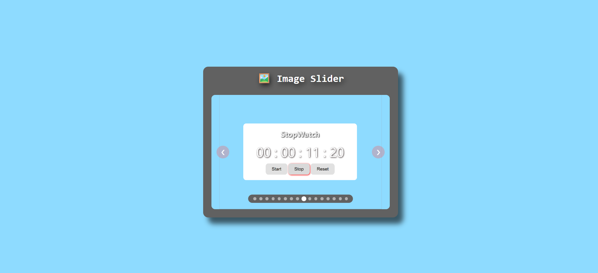

## Project 016 - Image Slider

# Image Slider

Image carousel navigation.

## Features

✅ Image display
✅ Next button
✅ Previous button
✅ Dot indicators
✅ Auto-play
✅ Captions
✅ Responsive design

## 🛠️ Technologies Used

- HTML5
- CSS3 (Flexbox, Transitions)
- Vanilla JavaScript (ES6+)

## Live Demo

🔗 [View Live](https://100-days-javascript-commitment.netlify.app/projects/016-image-slider/)

## What I Learned

# 🎯 CSS Key Learnings

## 1. Transform for Smooth Sliding

- `translateX()` creates GPU-accelerated animation, so performance is better.
- Negative value → move left
- Positive value → move right
- Better than `hide/show` because it creates a smooth transition.

```css
transform: translateX(-100%);
```

---

## 2. Overflow Hidden

- `overflow: hidden;` hides content outside the container.
- Only the current image stays visible inside the slider.
- This creates a "window effect".

```css
.slider-container {
  overflow: hidden;
}
```

---

## 3. Flexbox Layout

- `display: flex;` arranges items in a horizontal row.
- Slider images appear side by side.

```css
.slider-wrapper {
  display: flex;
}
```

---

## 4. Absolute Position Centering

### Vertical Center

```css
top: 50%;
transform: translateY(-50%);
```

### Horizontal Center

```css
left: 50%;
transform: translateX(-50%);
```

- `50%` moves the element toward the center.
- `translate` adjusts it based on its own size for perfect centering.

---

## 5. Transform Preservation

- You cannot write multiple transforms in separate lines.
- The second `transform` replaces the first one.

❌ Wrong:

```css
transform: translateY(-50%);
transform: scale(1.1);
```

✅ Correct:

```css
transform: translateY(-50%) scale(1.1);
```

- Always repeat the original transform in hover and active states.

---

## 6. Transitions

- `transition` creates smooth animation between states.
- Always apply it to the element that changes.

```css
.slider-btn {
  transition: all 0.3s;
}
```

---

# 💻 JavaScript Key Learnings

## 1. Arrow Functions & `this` Context

- Arrow functions use `this` from the parent scope.
- Regular functions create their own `this`.

```js
button.addEventListener("click", () => {
  console.log(this);
});
```

- Use arrow functions in event listeners when you want to preserve the object's `this`.

---

## 2. Dot Notation Rule

- Whatever comes before the dot becomes `this`.

```js
slider.next();
```

- Here, `this === slider`

---

## 3. Event Delegation

- Instead of adding listeners to every child, add one listener to the parent.
- Better performance.
- Also works for dynamically created elements.

```js
parent.addEventListener("click", (e) => {
  if (e.target.classList.contains("dot")) {
    console.log("Dot clicked");
  }
});
```

---

## 4. `dataset` Returns Strings

- `dataset.index` always returns a string.

```js
console.log(typeof element.dataset.index); // "string"
```

- Convert it into a number:

```js
const index = parseInt(element.dataset.index);
```

Or:

```js
const index = Number(element.dataset.index);
```

---

## 5. Array `map()` + `join()`

- `map()` transforms every item in the array.
- `join("")` combines everything into a single string.

```js
const html = images.map((img, index) => ``).join("");
```

- Then you can place it inside `innerHTML`.

---

## 6. Ternary Operator

- Useful for short `if-else` conditions.

```js
const next = current === last ? 0 : current + 1;
```

Format:

```js
condition ? valueIfTrue : valueIfFalse;
```

---

## 7. Loop Logic

### Last → First

```js
current = current === lastIndex ? 0 : current + 1;
```

### First → Last

```js
current = current === 0 ? lastIndex : current - 1;
```

- Used for circular navigation.

---

## 8. MVC Pattern

### Model

- Only data / state
- No DOM and no business logic

```js
const model = {
  currentSlide: 0,
};
```

### View

- Only updates the UI
- No state and no business logic

```js
const view = {
  render() {},
};
```

### Controller

- Handles events
- Connects Model and View

```js
const controller = {
  init() {},
};
```

Relationship:

```text
User Action → Controller → Model Update → View Update
```

## 📸 Preview


