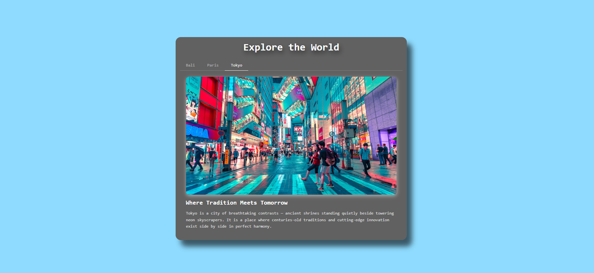

## Project 017 - Tabs Component

# 📑 Tabs Component

A travel destination tabs interface built with vanilla JavaScript using the MVC pattern.

## Features

✅ Multiple tabs
✅ Tab switching
✅ Active state
✅ Content display
✅ Smooth slide transition
✅ Responsive design
✅ MVC architecture

## 🛠️ Technologies Used

- HTML5
- CSS3 (Flexbox, Transitions, Transform, Media Queries)
- Vanilla JavaScript (ES6+)

## Live Demo

🔗 [View Live](https://100-days-javascript-commitment.netlify.app/projects/017-tabs-component/)

## What I Learned

### 🏗️ MVC Architecture

- Separated concerns into three distinct layers — `TabModel`, `TabView`, and `TabController`
- `TabModel` owns the data and state, `TabView` owns the DOM, `TabController` owns the logic
- Each layer has no knowledge of the other's internals — they communicate only through a clean public interface
- The model acts as the **single source of truth** — the UI always reflects model state, never the other way around

### 📦 Data Encapsulation with Object Literals

- Used `const Model = { ... }` pattern (singleton object literal) instead of a class
- Prefixed internal properties with `_` (e.g. `_tabs`, `_activeIndex`) to signal private data by convention
- Exposed data only through getter methods (`getTabs()`, `getActiveIndex()`) so outside code can read but not mutate directly
- Added validation in `setActiveIndex()` to silently ignore out of range values — protecting state integrity

### 🎠 Slider Mechanic with CSS Transform

- Built a sliding panel system identical in concept to an image slider
- All panels sit side by side in a `.tabs-track` that is `300%` wide (number of panels × 100%)
- `.tabs-content-wrapper` acts as the viewport with `overflow: hidden` — clipping everything outside its bounds
- Switching tabs just changes `translateX` on the track:

```
  index 0 → translateX(0%)
  index 1 → translateX(-33.33%)
  index 2 → translateX(-66.66%)
```

- `transition: transform 0.4s ease` on the track handles the smooth animation — no JavaScript animation needed

### 🎨 Active Tab Indicator Trick

- Every `.tab-item` always has `border-bottom: 2px solid transparent` — prevents layout shift when active border appears
- `margin-bottom: -2px` pulls the tab item down so the active white border **overlaps and covers** the nav baseline border
- This creates the illusion of a single continuous line where the active portion is highlighted
- `classList.toggle("active", i === index)` handles both adding and removing the active class in one clean line

### 🖱️ Event Delegation

- Attached a single click listener to `.tabs-nav` instead of one listener per tab item
- Used `e.target.dataset.index` to identify which tab was clicked via `data-index` attribute
- Added a guard clause with `e.target.closest(".tab-item")` to safely handle clicks on the nav gap

### 📐 Responsive Design

- Used two breakpoints — tablet at `768px` and mobile at `480px`
- Scaled padding, font sizes, and image height progressively at each breakpoint
- Used `aspect-ratio: 16/9` with `object-fit: cover` on images to maintain consistent proportions across all screen sizes without fixed height values

### 🗄️ DOM Caching

- Cached DOM references once in `TabView.elements` instead of querying the DOM on every interaction
- Understood the risk of caching at object definition time vs inside an `init()` method
- `init()` pattern ensures DOM is fully parsed before any queries run

### 📊 Data Attributes

- Used `data-index` on each `.tab-item` to bridge the gap between the DOM and the model
- Used `e.target.closest(".tab-item")` to safely identify the clicked tab item regardless of where exactly the click landed inside the nav
- Added a guard clause `if (!clicked) return` to silently ignore clicks on the nav gap — preventing `NaN` from being passed to the model
- `parseInt(clicked.dataset.index)` then safely converts the string attribute value to a number for use as an array index

```javascript
const clicked = e.target.closest(".tab-item"); // safe targeting
if (!clicked) return; // guard clause
const currentIndex = parseInt(clicked.dataset.index);
```

## 📸 Preview


