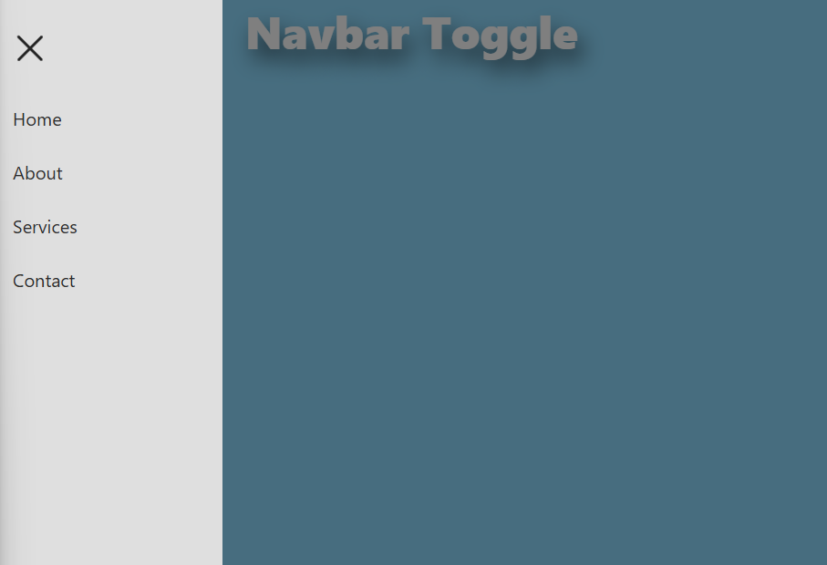

# Project 018 - Navbar Toggle

A standalone mobile navbar toggle component built with vanilla HTML, CSS, and JavaScript using the MVC pattern.

## Features

✅ Hamburger menu
✅ Menu toggle
✅ Navigation links
✅ Mobile responsive
✅ Smooth animation
✅ Close on link click
✅ Close on overlay click

## 🛠️ Technologies Used

- HTML5 (Semantic markup)
- CSS3 (Flexbox, Transitions, Transform)
- Vanilla JavaScript (ES6+, MVC Pattern)

## Live Demo

🔗 [View Live](https://100-days-javascript-commitment.netlify.app/projects/018-navbar-toggle/)

## 📸 Preview



## Project Structure

\```
018-navbar-toggle/
├── index.html
├── style.css
├── app.js
└── README.md
\```

## Architecture — MVC Pattern

| Layer             | File     | Responsibility                                    |
| ----------------- | -------- | ------------------------------------------------- |
| **NavModel**      | `app.js` | Holds `isOpen` state                              |
| **NavView**       | `app.js` | DOM references, CSS class toggling, event binding |
| **NavController** | `app.js` | Handles user events, syncs Model and View         |

## What I Learned

- Mobile navigation patterns
- Hamburger icon animation using CSS transforms
- Slide-in drawer animation with `translateX`
- Overlay backdrop pattern for accessible menu closing
- MVC architecture in vanilla JavaScript
- Separating DOM logic from state logic
- Z-index layering for stacked UI elements
