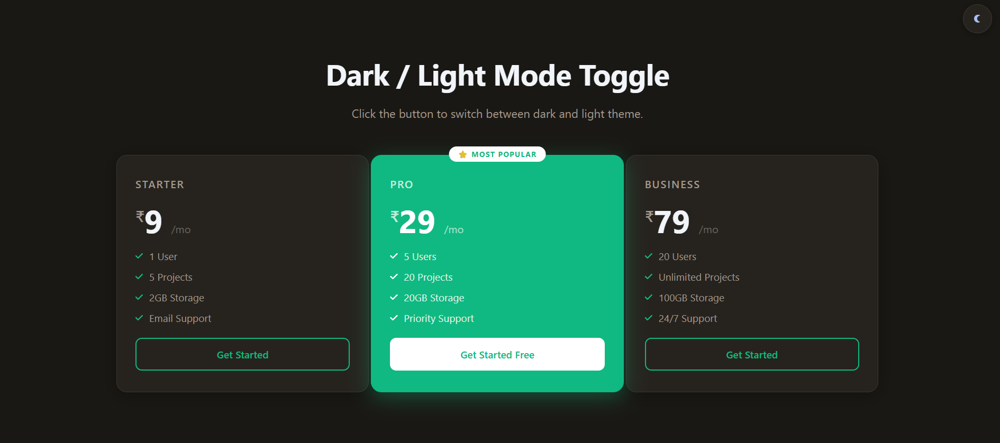

# 🌗 Project 019 — Dark/Light Mode Toggle

A pricing page UI with a fully functional dark/light mode toggle built using the **MVC pattern** in Vanilla JavaScript.

---

## ✅ Features

- 🌙 Dark mode toggle
- ☀️ Light mode toggle
- 🎨 Color theme change via CSS custom properties
- 💾 `localStorage` persistence across page reloads
- ✨ Smooth transition between themes
- 🔄 Icon change (Sun ↔ Moon) using FontAwesome
- 💳 Dynamic pricing cards rendered from JS object

---

## 🛠️ Technologies Used

- **HTML5** — Semantic structure
- **CSS3** — Custom properties (variables), transitions, responsive grid
- **Vanilla JavaScript (ES6+)** — MVC pattern, `localStorage` API
- **FontAwesome** — Sun / Moon icons

---

## 🏗️ Architecture — MVC Pattern

This project follows a clean **Model / View / Controller** separation:

| Layer             | Responsibility                                                   |
| ----------------- | ---------------------------------------------------------------- |
| `ThemeModel`      | Holds theme state, plans data, reads/writes `localStorage`       |
| `ThemeView`       | DOM cache, renders cards dynamically, updates UI on theme change |
| `ThemeController` | Wires Model + View, handles button click, initializes app        |

---

## 📁 Project Structure

```
019-dark-light-mode-toggle/
├── index.html
├── design.css
├── app.js
└── 019-dark-lightmodetoggle.png
```

---

## 🚀 Getting Started

1. Clone or download the repository
2. Open `index.html` directly in your browser
3. No build tools or dependencies required

---

## 🔗 Live Demo

[View Live →](https://100-days-javascript-commitment.netlify.app/projects/019-dark-lightmodetoggle/)

---

## 💡 What I Learned

- How to architect vanilla JS using the **MVC design pattern**
- Using **CSS custom properties** to manage a full color theme system
- Swapping themes with a single `.dark` class on `<body>`
- Persisting user preferences with the **`localStorage` API**
- Dynamically updating **FontAwesome icons** via `classList`
- Creating **smooth UI transitions** with CSS `transition` property
- **Dynamic DOM rendering** — pricing cards rendered from a JS data object
- Managing **persistent state** across page reloads without a framework

---

## 📸 Preview




---

> Part 019 of my **100 Days JavaScript Commitment** challenge.
