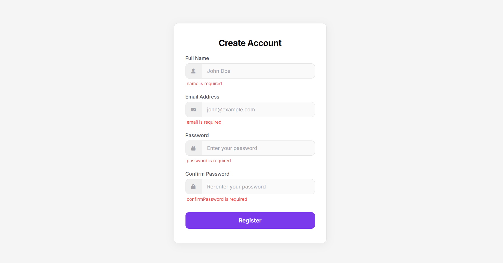

# 🔐 Project 020 — Form Validation

A form validation project built with HTML, CSS, and Vanilla JavaScript.

---

## ✅ Features

- 📝 Empty field validation
- 👁️ Real time feedback on blur
- 🎨 Icon box input design
- 🌗 Dark/light theme toggle
- ✅ Success message on valid form

---

## 🛠️ Technologies Used

- **HTML5** — Semantic structure
- **CSS3** — Custom properties (variables), transitions
- **Vanilla JavaScript (ES6+)** — DOM caching, event listeners
- **FontAwesome** — Input field icons

---

## 📁 Project Structure

    project-020/
    ├── index.html
    ├── style.css
    ├── script.js
    └── README.md

---

## 🚀 Getting Started

1. Clone or download the repository
2. Open `index.html` directly in your browser
3. No build tools or dependencies required

---

## 🔗 Live Demo

[View Live →](https://100-days-javascript-commitment.netlify.app/projects/020-form-validation/)

---

## 💡 What I Learned

- DOM caching using dynamic loop
- Separation of concerns — validation, display, events alag alag
- Blur vs submit validation strategy
- Conventional commits format
- CSS variables for theming
- Input wrapper + icon box design pattern
- `align-self: stretch` for full height elements
- `classList.remove` vs `remove` difference
- `:focus-within` pseudo class
- `Object.values`, `for...in` for object traversal

---

## 🔮 Future Scope

- Implement MVC pattern — Model, View, Controller
- Add valid/invalid border highlighting
- Add advanced validation rules — email format, password strength, match validation
- Add password visibility toggle
- Add loading state on submit button

---

## 📸 Preview

---

> Part 020 of my **100 Days JavaScript Commitment** challenge.
