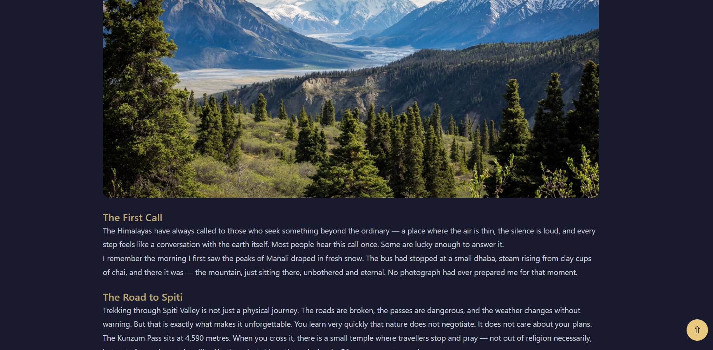

# ⬆️ Project 021 — Scroll to Top Button

A scroll to top button project built with HTML, CSS, and Vanilla JavaScript.

---

## ✅ Features

- 👁️ Button appears after 300px scroll
- 🔼 Smooth scroll to top on click
- 🎨 Theme matching circular button
- 💫 Fade in/out visibility transition

---

## 🛠️ Technologies Used

- **HTML5** — Semantic structure
- **CSS3** — Custom properties, transitions, fixed positioning
- **Vanilla JavaScript (ES6+)** — Scroll detection, DOM manipulation

---

## 📁 Project Structure

    project-021/
    ├── index.html
    ├── style.css
    ├── script.js
    └── README.md

---

## 🚀 Getting Started

1. Clone or download the repository
2. Open `index.html` directly in your browser
3. No build tools or dependencies required

---

## 🔗 Live Demo

[View Live →](https://100-days-javascript-commitment.netlify.app/projects/021-scroll-totopbutton/)

---

## 💡 What I Learned

- `window.scrollY` for scroll position detection
- `window.scrollTo()` with smooth behavior
- Fixed positioning for floating UI elements
- MVC pattern — Model, View, Controller separation
- Separation of concerns — state, DOM, events alag alag
- CSS variables for consistent theming
- `visibility` + `opacity` for smooth show/hide

---

## 🔮 Future Scope

- Add progress indicator ring around button
- Keyboard accessibility support
- Multiple theme support

---

## 📸 Preview

---

> Part 021 of my **100 Days JavaScript Commitment** challenge.
