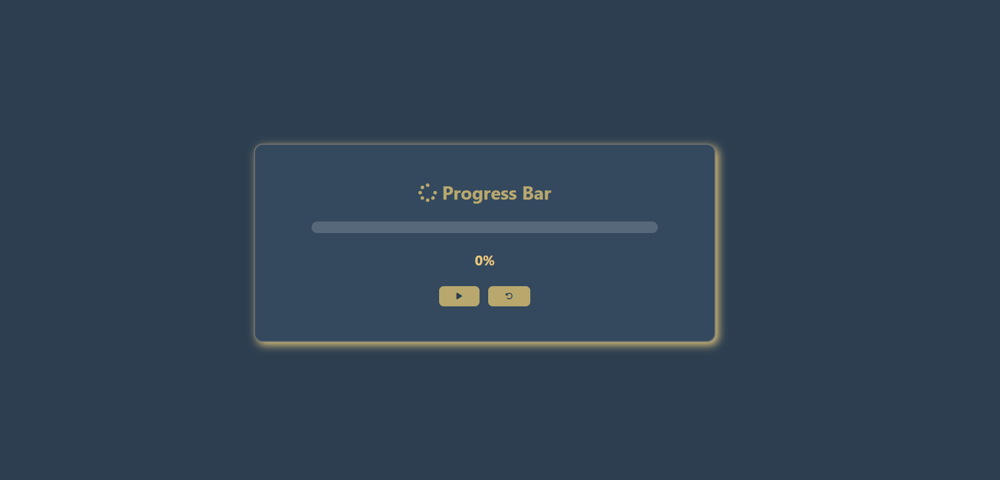

# 📊 Project 022 — Progress Bar

A dynamic progress bar project built with HTML, CSS, and Vanilla JavaScript.

---

## ✅ Features

- ▶️ Start button to begin progress
- 🔄 Reset button to clear progress
- 💫 Smooth animated fill effect
- 📝 Real-time percentage display
- 🛑 Auto stops at 100%

---

## 🛠️ Technologies Used

- **HTML5** — Semantic structure
- **CSS3** — Custom properties, transitions
- **Vanilla JavaScript (ES6+)** — setInterval, DOM manipulation
- **FontAwesome** — Icons

---

## 📁 Project Structure

    project-022/
    ├── 022-progress-bar.png
    ├── index.html
    ├── style.css
    ├── script.js
    └── README.md

---

## 🚀 Getting Started

1. Clone or download the repository
2. Open `index.html` directly in your browser
3. No build tools or dependencies required

---

## 🔗 Live Demo

[View Live →](https://100-days-javascript-commitment.netlify.app/projects/022-progress-bar/)

---

## 💡 What I Learned

- Proper use of `setInterval` and `clearInterval`
- MVC pattern — Model, View, Controller separation
- `this` context — keeping state inside handlers object
- Silent bugs — `clearInterval(undefined)` throws no error
- CSS transitions for smooth width animation
- State management with getter and setter methods

---

## 🔮 Future Scope

- Add color gradient as progress increases
- Add completion animation at 100%
- Add pause button

---

## 📸 Preview

---

> Part 022 of my **100 Days JavaScript Commitment** challenge.
