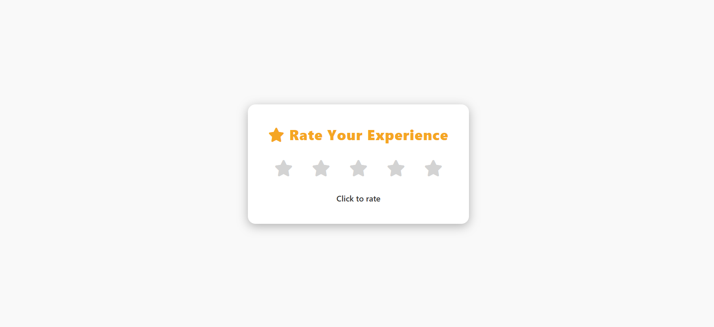

# ⭐ Project 023 — Star Rating Component

An interactive star rating component built with HTML, CSS, and Vanilla JavaScript.

---

## ✅ Features

- ⭐ 5 star interactive rating system
- 🖱️ Hover effect — highlights stars up to hovered star
- 🔒 Click to lock selected rating
- 💬 Dynamic feedback message
- 🎨 Clean light theme design

---

## 🛠️ Technologies Used

- **HTML5** — Semantic structure
- **CSS3** — Custom properties, transitions
- **Vanilla JavaScript (ES6+)** — DOM manipulation, event handling
- **FontAwesome** — Star icons

---

## 📁 Project Structure

    project-023/
    ├── 023-star-ratingcomponent.png
    ├── index.html
    ├── style.css
    ├── script.js
    └── README.md

---

## 🚀 Getting Started

1. Clone or download the repository
2. Open `index.html` directly in your browser
3. No build tools or dependencies required

---

## 🔗 Live Demo

[View Live →](https://100-days-javascript-commitment.netlify.app/projects/023-star-ratingcomponent/)

---

## 💡 What I Learned

- `mouseover` and `mouseout` events for hover effects
- `data-*` attributes to store element specific data
- State management — `selectedRating` to restore stars on mouseout
- DRY principle — reusing `updateStars` across click, hover, mouseout
- MVC pattern — clean separation of Model, View, Controller
- `dataset.value` always returns string — `Number()` conversion needed

---

## 🔮 Future Scope

- Add half star rating support
- Add animation on rating selection
- Add rating persistence with localStorage

---

## 📸 Preview

---

> Part 023 of my **100 Days JavaScript Commitment** challenge.
