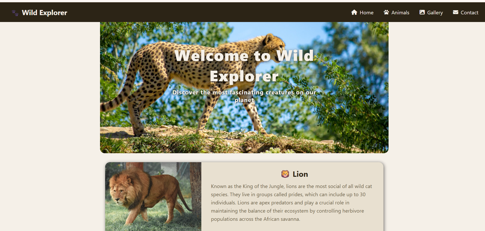

# 📌 Project 024 — Sticky Navbar

A sticky navigation bar project built with HTML, CSS, and Vanilla JavaScript.

---

## ✅ Features

- 📌 Navbar sticks to top after scrolling past top bar
- 🐾 Dynamic animal cards rendered from data object
- 🦁 6 animal profiles with images and descriptions
- 🎨 Safari warm theme with accent colors
- 📱 Responsive layout

---

## 🛠️ Technologies Used

- **HTML5** — Semantic structure
- **CSS3** — Custom properties, fixed positioning, transitions
- **Vanilla JavaScript (ES6+)** — Scroll detection, dynamic rendering
- **FontAwesome** — Navigation icons
- **Unsplash** — Animal images

---

## 📁 Project Structure

    project-024/
    ├── 024-sticky-navbar
    ├── index.html
    ├── style.css
    ├── script.js
    └── README.md

---

## 🚀 Getting Started

1. Clone or download the repository
2. Open `index.html` directly in your browser
3. No build tools or dependencies required

---

## 🔗 Live Demo

[View Live →](https://100-days-javascript-commitment.netlify.app/projects/024-sticky-navbar/)

---

## 💡 What I Learned

- `offsetHeight` to get element's actual height
- `position: fixed` vs `position: sticky` difference
- Compensating layout jump with `paddingTop` on body
- Threshold calculation using topbar height
- Dynamic content rendering using `map` and `innerHTML`
- `aspect-ratio` CSS property for consistent image sizing
- `transform: translate(-50%, -50%)` for perfect centering

---

## 🔮 Future Scope

- Implement MVC pattern
- Add smooth navbar transition on stick
- Add search functionality for animals

---

## 📸 Preview

---

> Part 024 of my **100 Days JavaScript Commitment** challenge.
